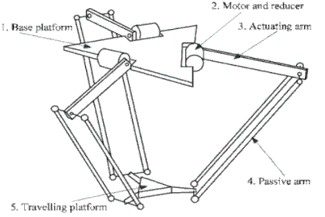

# foundations_robot_kinematics

This is a compilation of some robot kinematics studies and examples that I did during college and updated to be run with ROS.

I hope it can be useful to others :)

## 3R Planar Robot

* **3r_planar_forward:** A 3R planar robot example using forward kinematics

* **3r_planar_inverse:** A 3R planar robot example using inverse kinematics

* **3r_planar_jacobian:** A 3R planar robot example using jacobian

## Stanford Robot

* **stanford_jacobian:** A stanford robot example using jacobian

* **3rrr_planar_inverse:** A 3RRR parallel robot using inverse kinematics

## Delta Robot

* **delta_forward:** A delta parallel robot using forward kinematics

* **delta_inverse:** A delta parallel robot using inverse kinematics

## Stewart Robot

* **stewart_inverse:** A stewart parallel robot using inverse kinematics

## Anthropomorphic Robot

* **anthropomorphic_forward:** An anthropomorphic serial robot using forward kinematics

* **anthropomorphic_inverse:** An anthropomorphic serial robot using inverse kinematics

## Puma 560 Robot

* **puma_forward:** A Puma 560 serial robot using forward kinematics

* **puma_inverse:** A Puma 560 serial robot using inverse kinematics

## Running

With roscore running, every example node can be run with:

    rosrun foundations_robot_kinematics [node_name]

## To Do list

A script to select and run examples

Refactor hardcoded robot's params to a config file